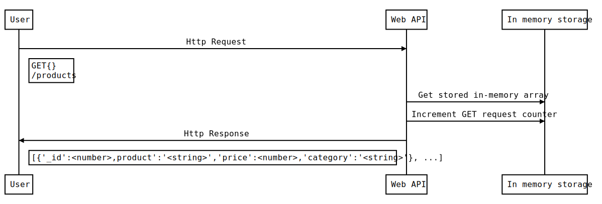

# REST_API_MAPD713_Assignment_01

- Node.js http server to store and retrieve product information using HTTP GET and POST
requests and JSON data format.

- Following are the sequence diagrams, reflecting the application logic

## GET

## POST

## DELETE

